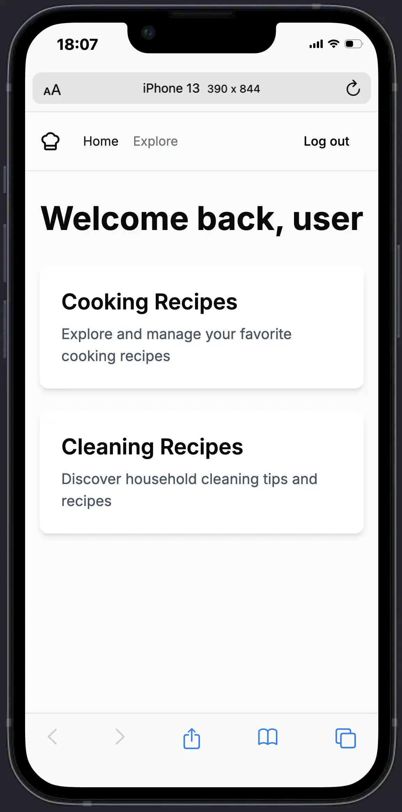
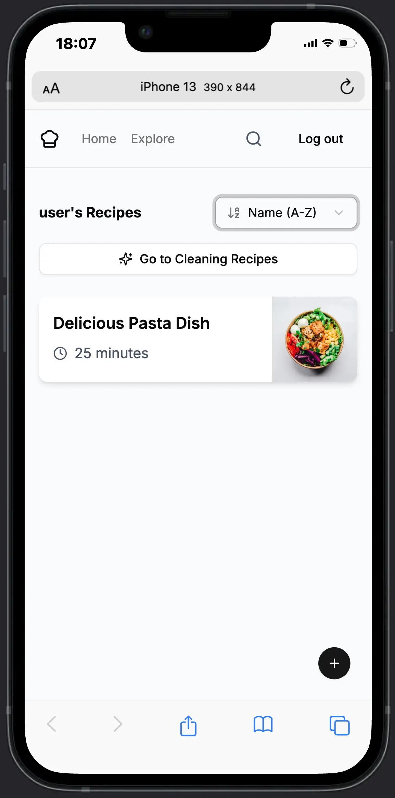
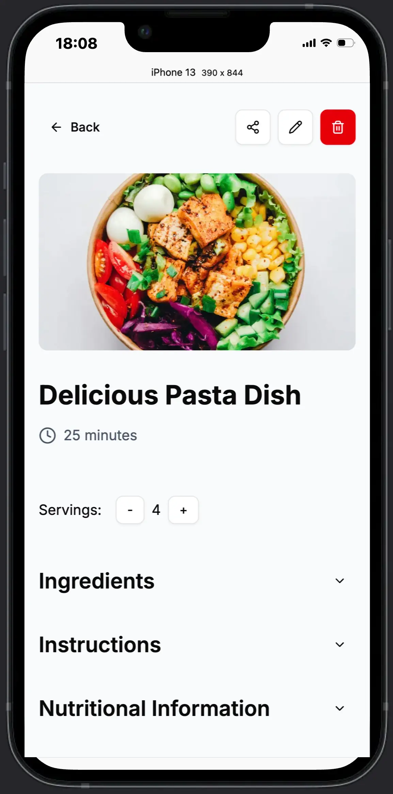
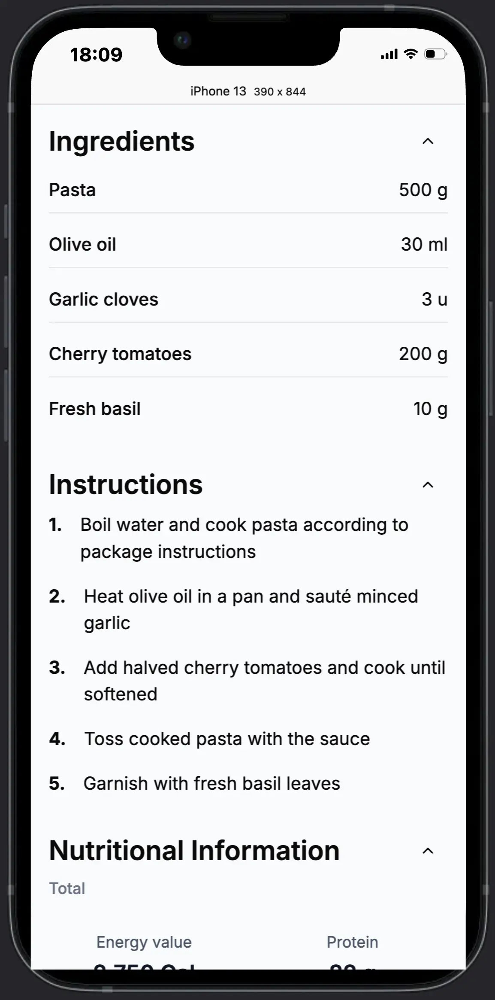

# Recipe Master 🍽️

A powerful, full-stack web application that helps you organize and manage both cooking and cleaning recipes in one place. Built with modern technologies and best practices.

<div style="display: flex; justify-content: center;">




</div>

## 🚀 Features

### Authentication & User Management

- **Secure User Authentication**: Email-based authentication using Supabase Auth
- **User Profiles**: Personalized experience with user profiles and usernames
- **Password Reset**: Secure password recovery workflow with email verification

### Recipe Management

- **Dual Recipe Categories**: Manage both cooking recipes and cleaning recipes
- **CRUD Operations**: Create, read, update, and delete your recipes
- **Rich Formatting**: Store detailed instructions, ingredients, and photos
- **Real-time Updates**: Changes to recipes are reflected instantly using Supabase realtime subscriptions
- **Recipe Sharing**: Share your favorite recipes with friends via unique links

### AI-Powered Features

- **Nutritional Analysis**: Automatically calculate macronutrients (calories, protein, carbs, fats) from your ingredients using OpenAI API
- **Smart Recommendations**: Get personalized recipe suggestions based on your preferences

### Search & Organization

- **Advanced Sorting**: Sort recipes by name or creation date
- **Smart Filtering**: Filter recipes by various attributes

### Modern UI/UX

- **Responsive Design**: Fully responsive interface that works on mobile, tablet, and desktop
- **Dark/Light Mode**: Support for system theme preferences
- **Interactive UI Components**: Smooth transitions and intuitive controls built with shadcn/ui
- **Toast Notifications**: Informative feedback for user actions

## 💻 Tech Stack

### Frontend

- **Next.js 15** with App Router for server components and optimized rendering
- **React 19** for building interactive user interfaces
- **TypeScript** for type-safe code
- **TailwindCSS** for beautiful, responsive styling
- **shadcn/ui** for accessible, customizable UI components
- **Cloudinary** for image optimization and storage

### Backend

- **Next.js API Routes** for serverless functions
- **Supabase** for authentication, database, and real-time subscriptions
- **OpenAI API** for intelligent recipe analysis and suggestions

### Infrastructure

- **Vercel** for seamless deployment and hosting
- **Supabase PostgreSQL** for data storage

## 🌟 Unique Selling Points

- **All-in-One Solution**: No need for separate apps to manage cooking and cleaning recipes
- **AI Integration**: Nutritional analysis powered by OpenAI's latest models
- **Real-time Collaboration**: Changes to recipes are instantly reflected across devices
- **Modern Architecture**: Built with the latest web technologies for performance and maintainability
- **Mobile-Friendly**: Use on any device with a responsive design

## 📈 Future Plans

- Advanced AI-generated recipes based on available ingredients
- Shopping list generation from recipes
- Meal planning calendar
- Public recipe discovery and marketplace
- Enhanced analytics for nutrition tracking
- Mobile app using React Native

## 🔧 Installation & Setup

```bash
# Clone the repository
git clone https://github.com/your-username/recipe-master.git

# Install dependencies
npm install

# Set up environment variables (see .env.example)

# Run the development server
npm run dev
```

## 📱 Usage

1. Register a new account or login
2. Create your first recipe by clicking the "+" button
3. Browse your recipes on the homepage
4. Edit or delete recipes as needed
5. Switch between cooking and cleaning recipe modes
6. Share your favorite recipes with friends

## 🔒 Environment Variables

The following environment variables are required:

- `NEXT_PUBLIC_SUPABASE_URL`: Your Supabase project URL
- `NEXT_PUBLIC_SUPABASE_ANON_KEY`: Your Supabase anonymous key
- `OPENAI_API_KEY`: Your OpenAI API key for nutrition analysis

## 👨‍💻 About the Developer

This project was built by a passionate full-stack developer with a focus on creating intuitive, high-performance web applications that solve real problems. The codebase demonstrates expertise in modern React patterns, API integrations, authentication flows, and responsive design.

---

Built with ❤️ using Next.js, React, TypeScript, and Supabase
