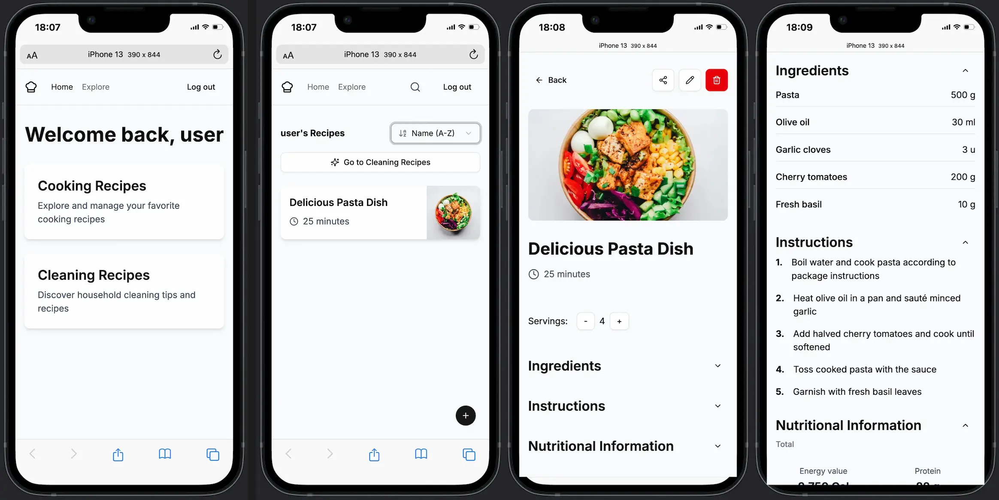

# Recipe Master 🍽️

A full-stack comprehensive culinary and cleaning recipe management web app built with cutting-edge web technologies. Recipe Master stands as the definitive solution for organizing, creating, and sharing recipes intuitively and efficiently.

<div align="center">
  <a href="https://nextjs.org" target="_blank">
    
  </a>
  <a href="https://react.dev" target="_blank">
    
  </a>
  <a href="https://tailwindcss.com" target="_blank">
    
  </a>
  <a href="https://supabase.com" target="_blank">
    
  </a>
  <a href="https://openai.com" target="_blank">
    
  </a>
  <a href="https://tanstack.com/query/latest" target="_blank">
    
  </a>
  <a href="https://dndkit.com/" target="_blank">
    
  </a>
</div>

<br />

<div align="center">
  <div style="display: flex; justify-content: center; gap: 20px; margin: 40px 0;">
    
    
  </div>
</div>

## 🚀 Key Features

### Advanced User Experience

- **Multilingual Interface**: Complete support for English and Spanish, with architecture ready for expansion to more languages
- **Responsive Design**: Optimal experience across mobile, tablets, and desktop devices
- **Intuitive UX**: Clean interfaces and optimized workflows to maximize user productivity

### Complete Recipe Management

- **Dual Categories**: Unified system for managing both cooking and cleaning recipes
- **CRUD Operations**: Create, read, update, and delete recipes with user-friendly interfaces
- **Rich Formatting**: Detailed storage of instructions, ingredients, materials, and photos
- **Real-time Updates**: Changes reflected instantly thanks to Supabase real-time subscriptions
- **Recipe Sharing**: Easy distribution via unique links to share with friends
- **Drag & Drop Organization**: Intuitive step reorganization with DND Kit's power

### AI Integration

- **Nutritional Analysis**: Automatic calculation of macronutrients (calories, protein, carbohydrates, fats) from ingredients
- **Recipe Generation**: Automatic creation of complete recipes based on simple ideas or names
- **Intelligent Recommendations**: Personalized suggestions based on preferences and history
- **Ingredient Analysis**: Automatic interpretation of ingredient lists using OpenAI
- **Recipe Transcription**: Ability to convert free text into structured recipes

### Superior Search and Organization

- **Advanced Sorting**: Sort recipes by name, creation date, and more
- **Intelligent Filtering**: Filter recipes by multiple attributes simultaneously
- **Fuzzy Search**: Implementation with Fuse.js for error-tolerant searches
- **Intuitive Categorization**: Clear organization between cooking and cleaning recipes

### Collaboration and Sharing

- **User Profiles**: Personalized experience with detailed profiles
- **Recipe Exploration**: Discovery of recipes shared by other users
- **Rating System**: Feedback on shared recipes (coming soon)

### Specialized Tools

- **Temperature Guide**: Precise references for safe cooking of various meat types
- **Intelligent Shopping List**: Generation and management of shopping lists from recipes
- **Rotating Tips**: Dynamic culinary suggestions that periodically change
- **Bug Reporting System**: Integrated tool for reporting issues including screenshots

### Security and Privacy

- **Robust Authentication**: Secure email-based system using Supabase Auth
- **Password Management**: Secure recovery and reset flows
- **Personal Data Control**: Complete control over personal information with account deletion option
- **Access Policies**: Implementation of security policies for data protection

### Infrastructure and Performance

- **Performance Analysis**: Optimized metrics with Vercel Analytics & Speed Insights
- **Rate Limiting**: Efficient API request management with Limiter
- **Image Optimization**: Efficient management through Cloudinary

## 💻 Tech Stack

### Frontend

- **Next.js 15** with App Router for server components and optimized rendering
- **React 19** for rich, interactive user interfaces
- **TypeScript** for type-safe, maintainable code
- **TailwindCSS 4** for responsive, modern styling
- **shadcn/ui** for accessible, customizable UI components
- **Cloudinary** for image optimization and storage
- **TanStack Query 5** for advanced state management and data caching
- **DND Kit** for drag and drop functionality
- **React Hook Form** with Zod for robust validations
- **Recharts** for attractive data visualizations
- **Sonner** for elegant notifications

### Backend

- **Next.js API Routes** for serverless functions
- **Supabase** for authentication, database, and real-time subscriptions
- **OpenAI API** for intelligent recipe analysis and suggestions
- **Nodemailer** for customized email sending

### Infrastructure

- **Vercel** for continuous deployment and hosting
- **Supabase PostgreSQL** for data storage
- **Vercel Analytics & Speed Insights** for performance monitoring

## 🌟 Technical Excellence

- **Component Architecture**: Meticulously organized component structure following best practices
- **Custom Hooks**: Reusable logic encapsulated in custom React hooks
- **Context API Implementation**: Efficient state management with Context API
- **Server-Side Rendering**: Optimized SSR for improved SEO and performance
- **API Design**: RESTful API endpoints with proper error handling
- **Database Schema Design**: Relational database design with foreign key relationships
- **Authentication Flow**: Secure user authentication with email verification
- **Real-time Data**: Implementing Supabase real-time subscriptions for instant updates
- **Internationalization**: Complete i18n system with dynamic language switching
- **Accessibility**: WCAG compliance with aria attributes and keyboard navigation
- **Performance Optimization**: Lazy loading, code splitting, and optimized builds
- **Testing Methodology**: Comprehensive unit and integration tests
- **CI/CD Pipeline**: Automated testing and deployment workflows

## 📈 Future Development

- AI-generated recipes based on available ingredients
- Automatic shopping list generation from recipes
- Meal planning calendar
- Public recipe discovery and marketplace
- Advanced analytics for nutrition tracking
- Mobile app using React Native
- Multilingual support expansion

## 🔧 Installation & Setup

```bash
# Clone the repository
git clone https://github.com/your-username/recipe-master.git

# Install dependencies
npm install

# Set up environment variables (see .env.example)

# Run the development server
npm run dev
```

## 📱 Usage

1. Register a new account or login
2. Create your first recipe by clicking the "+" button
3. Browse your recipes on the homepage
4. Edit or delete recipes as needed
5. Switch between cooking and cleaning recipe modes
6. Share your favorite recipes with friends
7. Report any issues with the bug reporting tool

## 🔒 Environment Variables

The following environment variables are required:

- `NEXT_PUBLIC_SUPABASE_URL`: Your Supabase project URL
- `NEXT_PUBLIC_SUPABASE_ANON_KEY`: Your Supabase anonymous key
- `OPENAI_API_KEY`: Your OpenAI API key for nutrition analysis
- `CLOUDINARY_CLOUD_NAME`: Your Cloudinary cloud name
- `CLOUDINARY_API_KEY`: Your Cloudinary API key
- `CLOUDINARY_API_SECRET`: Your Cloudinary API secret
- `EMAIL_SERVER_HOST`: Email server host
- `EMAIL_SERVER_PORT`: Email server port
- `EMAIL_SERVER_USER`: Email server user
- `EMAIL_SERVER_PASSWORD`: Email server password
- `SMTP_HOST`: SMTP host for error reports
- `SMTP_PORT`: SMTP port
- `SMTP_USER`: SMTP user
- `SMTP_PASSWORD`: SMTP password
- `ADMIN_EMAIL`: Admin email for receiving reports

## 👨‍💻 About the Developer

This project was developed by a passionate full-stack engineer focused on creating high-performance web applications that solve real-world problems. The codebase demonstrates mastery of:

- Modern React patterns and best practices
- Complex state management solutions
- API integrations and data fetching strategies
- Authentication flows with security at the forefront
- Responsive design techniques
- Real-time data synchronization
- AI integration through OpenAI
- Database design and optimization
- Internationalization implementation
- Accessible UI/UX design

The application implements professional development practices including:

- Scalable and maintainable architecture
- Complete internationalization
- Comprehensive testing
- Clear documentation
- Optimized UX/UI
- Continuous integration and deployment

## 🤝 Contributing

Contributions are welcome! Please feel free to submit a Pull Request.

## 📄 License

This project is licensed under the MIT License - see the [LICENSE](LICENSE) file for details.

---

Built with ❤️ using Next.js 15, React 19, TypeScript, and Supabase
